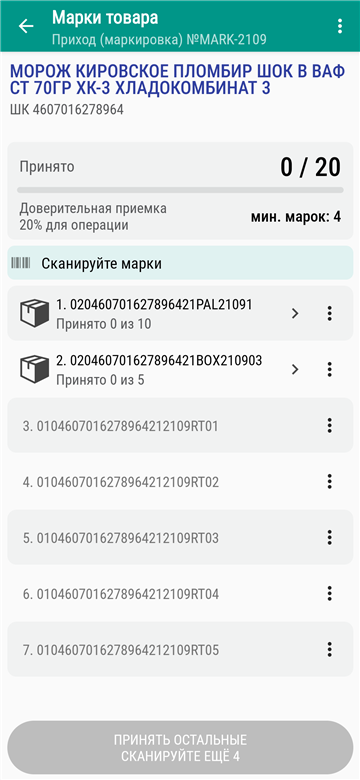
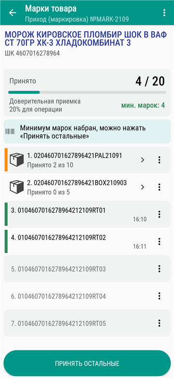
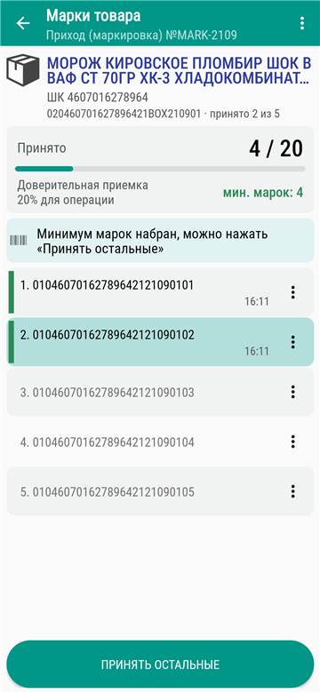
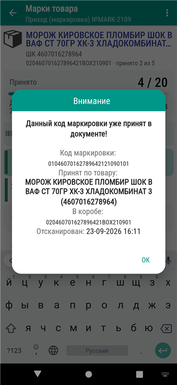
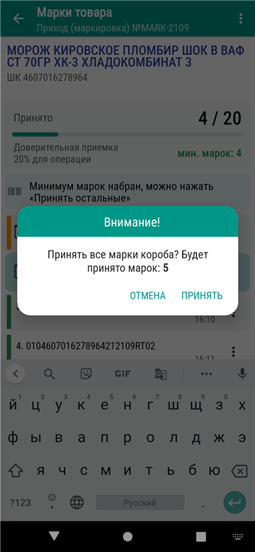
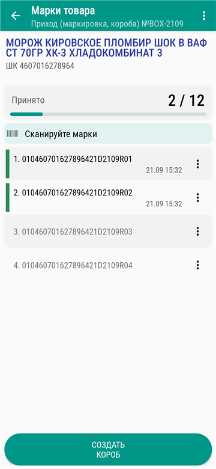
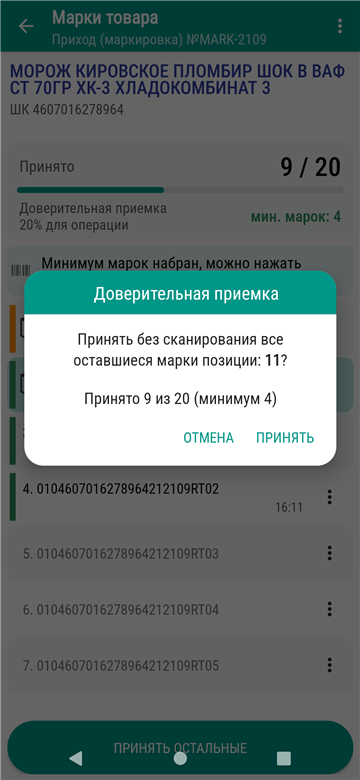
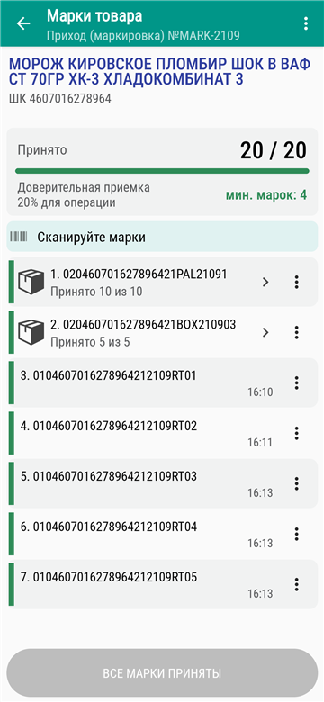
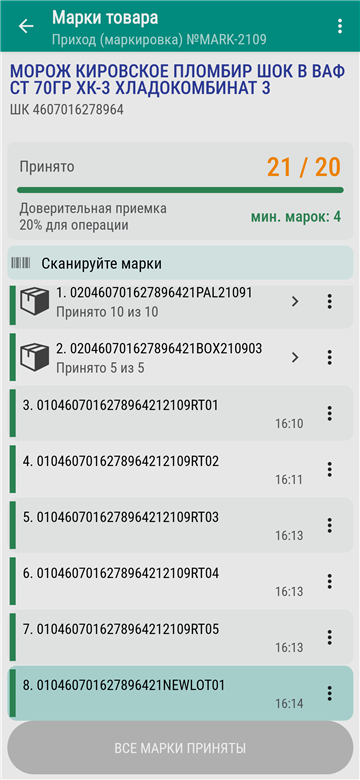

# Работа с маркировкой: что нового

## Главное

- Экран марок переработан и стал **одинаковым для всех версий** (RU и BY).
- Марку можно сканировать **сразу на экране ввода товара**: товар определяется по марке сам.
- Доверительная приёмка считается **по всей позиции**, а не по отдельному коробу, и на экране видно, сколько марок осталось до минимума.
- Сообщение о повторном скане марки теперь показывает, **где и когда** она уже принята.

## Экран «Марки товара»

 

*Слева: экран марок до сканирования · Справа: марки приняты частично*

- В заголовке — операция и номер документа, в шапке — наименование и штрихкод товара.
- Карточка прогресса: «принято N / M» и полоса выполнения.
  - M — количество по заказу, а если заказа нет — все марки позиции.
  - Когда принято всё, полоса становится зелёной. Если принято больше, чем в заказе, счётчик выделяется цветом.
- Над списком — подсказка, что делать дальше: «Сканируйте марки», «Сканируйте марки в коробе» или «Минимум марок набран…».
- В каждой строке списка:
  - порядковый номер и код марки;
  - время скана (если марку сканировали не сегодня, показывается и дата);
  - цветная полоса статуса: зелёная — принята, оранжевая — короб принят частично, красная — ошибка короба;
  - непринятые марки показаны бледным шрифтом, принятые — чёрным.
- У короба в строке пишется «Принято X из Y» с учётом вложенных коробов. Короб открывается нажатием на строку.
- Когда открыт короб, в шапке виден его код и сколько марок в нём принято.
- В меню «⋮» строки остаются только доступные действия: «Снять отметку о приёмке», «Удалить» (если включено «Разрешить удаление марки»). Если действий нет, меню не показывается.
- Если снять отметку с короба, сначала появится вопрос с числом марок, с которых она будет снята.

*Открыт короб: код и принято в шапке*

## Сканирование на экране марок

- Если отсканирована марка документа, она принимается, а приложение само открывает нужный короб и выделяет её в списке.
- Если отсканирована **уже принятая** марка, появляется подробное сообщение:
  - код маркировки (или код агрегации — для короба);
  - по какому товару и в каком коробе марка уже принята;
  - время скана;
  - для короба — сколько марок в нём принято.

  После сообщения марка выделяется в списке. Отметка с неё **не снимается** (раньше приложение предлагало её сбросить).
- Если отсканирован короб при включённой настройке «Разрешить приёмку короба», приложение спросит: «Принять все марки короба? Будет принято марок: N».
- Если отсканирована новая марка:
  - при включённой настройке «Разрешить ввод новой марки» она добавляется в список сразу принятой;
  - без этой настройки появляется сообщение «Ввод новой марки запрещён!».
- Марка другого товара не принимается: появляется сообщение «Код маркировки относится к другому товару!».
- При включённой настройке «Запретить ввод марки без остатка» принимаются только марки и коробы, которые есть в выгруженных остатках марок. Иначе появляется сообщение «Марки нет на остатке!». Проверка действует и для марок документа, и для новых марок, когда документ набирается с нуля. Если ввод новой марки запрещён, сначала срабатывает этот запрет.

 

*Слева: повторный скан принятой марки · Справа: приёмка короба сканом*

## Создание короба

- Кнопка «Создать короб» видна, только когда включены обе настройки: «Разрешить создание короба» и «Разрешить ввод новой марки».
- При доверительной приёмке кнопки «Создать короб» нет.
- Пустой короб не меняет количество по позиции.

*Кнопка «Создать короб»*

## Доверительная приёмка

- Внизу экрана всегда есть кнопка **«Принять остальные»**.
  - Пока минимум не набран, кнопка неактивна, а на ней написано, сколько марок нужно отсканировать ещё.
  - Когда всё принято, на кнопке написано «Все марки приняты».
- Кнопка принимает **все оставшиеся марки позиции**, на каком бы уровне списка вы ни находились. Перед этим приложение спрашивает подтверждение и показывает, сколько марок уже принято и какой требуется минимум.
- На экране виден процент доверительной приёмки и откуда он взят: **для строки, для товара, для поставщика или для операции**.
- Процент для поставщика задаётся в карточке поставщика («Доверительная приёмка», «Процент доверительной приёмки»).
- Меню короба «Проверено», «Закрыть короб с ошибками» и «Закрыть без проверки» **убрано**. Вместо него используется кнопка «Принять остальные».

 

*Слева: подтверждение доверительной приёмки · Справа: все марки приняты*

## Скан марки на экране ввода товара

Работает при добавлении товара в операции с маркировкой.

- Если отсканировать марку вместо штрихкода, товар определяется по марке.
- Марка принимается, и сразу открывается экран «Марки товара» с выделенной маркой.
- Если отсканировать штрихкод маркированного товара, экран марок открывается сразу после скана.
- Если марка уже принята в документе, появляется подробное сообщение (как на экране марок), и количество не добавляется.
- Код короба передаётся на экран марок и обрабатывается там по правилам приёмки коробов.
- При включённой настройке «Запретить ввод марки без остатка» марка или короб, которых нет в остатках, не принимаются, и товар не выбирается.
- Если позицию не сохранить (например, количество 0 при запрете нулевого количества), она удаляется вместе со своими марками.
- При правке уже введённой позиции экран марок автоматически не открывается. Марки позиции открываются нажатием на строку в списке товаров документа.

*Марка со скана на экране ввода принята и выделена*

## Количество по маркам

- Настройка переименована: теперь она называется **«Количество товара по принятым маркам»**.
- После работы на экране марок количество позиции становится равным числу принятых марок.
- На экране ввода товара количество маркированного товара подставляется из числа принятых марок, а ручной ввод количества закрыт. Так количество не расходится с марками.
- Если эта настройка выключена, но включена настройка «Сверять количество с принятыми марками», то при выходе с экрана марок, если число принятых марок не совпадает с количеством товара, появляется предупреждение. Проверка срабатывает, только если марки на экране меняли.
